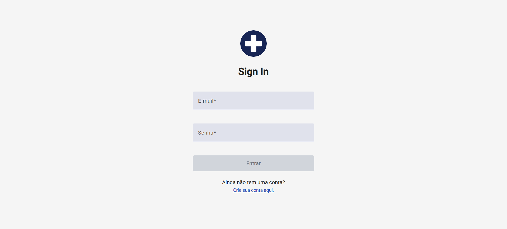
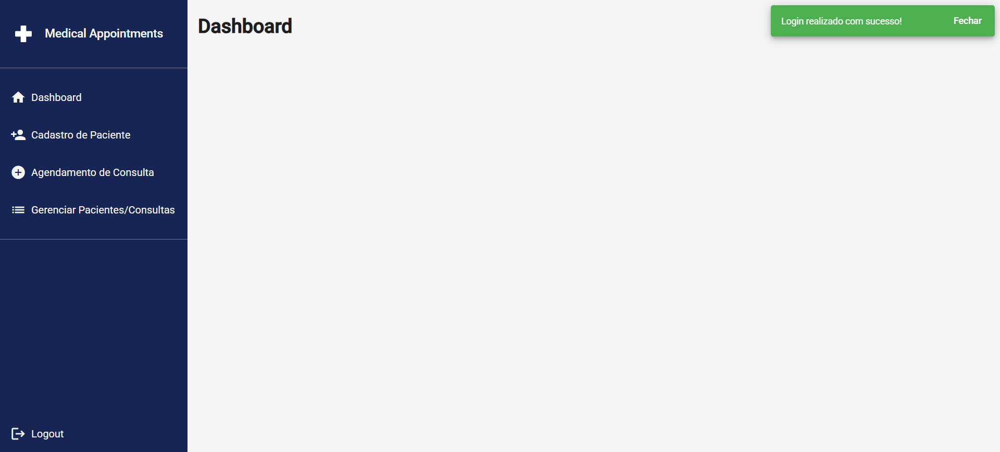
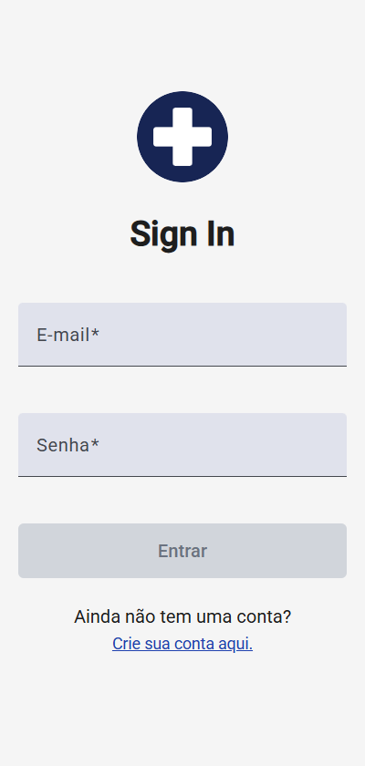
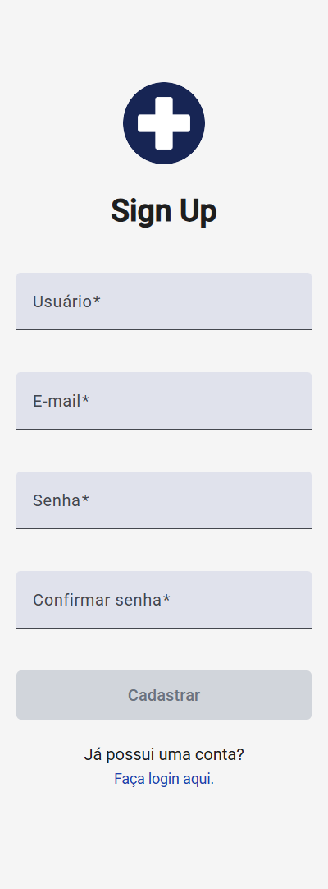

## 🔐 Login e Cadastro - Angular + Firebase + Angular Material

Aplicação de autenticação desenvolvida com Angular, utilizando Firebase Authentication para gerenciamento de usuários.
A interface foi construída com Angular Material e SCSS, e os formulários utilizam Reactive Forms (FormBuilder) para criação reativa e validação.

O projeto segue uma arquitetura feature-based, com foco em boas práticas, testes unitários, experiência do usuário e manutenibilidade, visando escalabilidade e facilidade de evolução do código.

## 🧱 Arquitetura

- Arquitetura **feature-based** para organização por domínio
- Camada **core** para recursos reutilizáveis e desacoplados
- Separação clara entre layout, páginas, serviços e guards
- Código orientado à manutenibilidade e escalabilidade

## 🚀 Tecnologias Utilizadas

- Angular v18
- Firebase Authentication
- Angular Material
- SCSS (Sass)
- Reactive Forms / FormBuilder
- TypeScript
- Jasmine / Karma

## ⚙️ Funcionalidades

- Autenticação de usuários com **login via e-mail e senha**
- **Cadastro de usuários** com nome, e-mail, senha e confirmação de senha
- **Validação reativa de formulários** utilizando Reactive Forms (FormBuilder)
- **Feedback visual por meio de toasts** para ações de sucesso e erro
- **Proteção de rotas com Guards**, tanto para rotas de autenticação quanto da aplicação
- **Redirecionamento automático** baseado no estado de autenticação
- **Interface responsiva e moderna**, construída com Angular Material

## 🔐 Segurança e Controle de Acesso

- Proteção de rotas com **Auth Guards**
- Separação entre rotas públicas e privadas
- Redirecionamento automático baseado no estado de autenticação

## 🧪 Testes

- Testes unitários para serviços, guards e componentes
- Uso de **Jasmine** e **Karma**
- Foco em confiabilidade, regressão e manutenibilidade

## 🧩 Estrutura do Projeto

```
src/
 ├─ app/
 │  ├── core/
 │  │   ├── adapters/             # Mapeamento e adaptação de dados
 │  │   ├── constants/            # Constantes globais
 │  │   ├── interfaces/           # Contratos e tipagens
 │  │   ├── services/             # Serviços reutilizáveis (ex: Firebase, Auth)
 │  │   └── validators/           # Validadores customizados
 │  │
 │  ├── features/
 │  │   ├── app/
 │  │   │   ├── layout/           # Layout principal (navbar, sidebar)
 │  │   │   ├── pages/            # Páginas protegidas (dashboard)
 │  │   │   └── pages.routes.ts
 │  │   │
 │  │   ├── auth/
 │  │   │   ├── dtos/             # Data Transfer Objects
 │  │   │   ├── guards/           # Guards de autenticação
 │  │   │   ├── layout/           # Layout público (login/cadastro)
 │  │   │   ├── pages/            # Login e Register
 │  │   │   ├── services/         # Serviços de autenticação
 │  │   │   └── auth.routes.ts
 │  │
 │  └── app.component.ts
 │
 └── styles/                      # Estilos globais
 ```

## 🔧 Como Executar

1. Clonar o repositório

```bash
git clone https://github.com/pedrogles/medical-appointments.git
```


2. Instalar dependências

```bash
npm install
```


3. Configurar Firebase

- Crie um projeto no Firebase Console
- Ative Authentication → E-mail/Senha
- Adicione as credenciais em src/environments/environment.ts:

```
export const environment = {
  firebase: {
    apiKey: 'SUA_API_KEY',
    authDomain: 'SEU_DOMINIO.firebaseapp.com',
    projectId: 'SEU_PROJECT_ID',
    storageBucket: 'SEU_BUCKET.appspot.com',
    messagingSenderId: 'SEU_ID',
    appId: 'SEU_APP_ID'
  },
};
```

4. Executar a aplicação

```bash
ng serve
```


Acesse: http://localhost:4200

## 🧠 Principais Recursos do Angular Utilizados

- Reactive Forms com FormBuilder
- Angular Material para UI e UX
- SCSS modularizado
- Arquitetura escalável: core e features

## 🖼️ Screenshots

### Desktop
<div style="display: flex; flex-direction: column; gap: 1rem">
  
  
  
</div>

### Mobile
<div style="display: flex; flex-direction: column; gap: 1rem">
  <div style="display: flex; align-items: flex-start; gap: 1rem">
    
    
  </div>
  <div style="display: flex; gap: 1rem">
    
    
  </div>
</div>