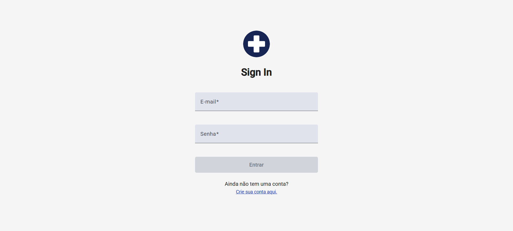
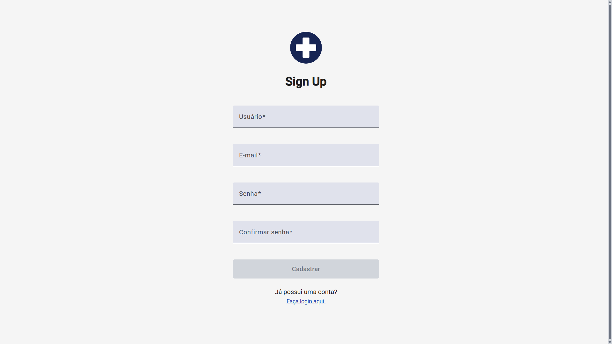
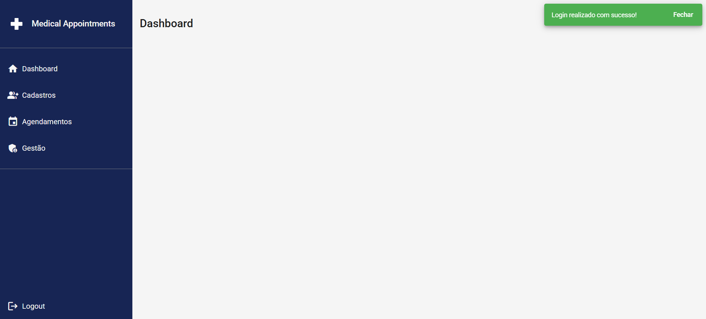
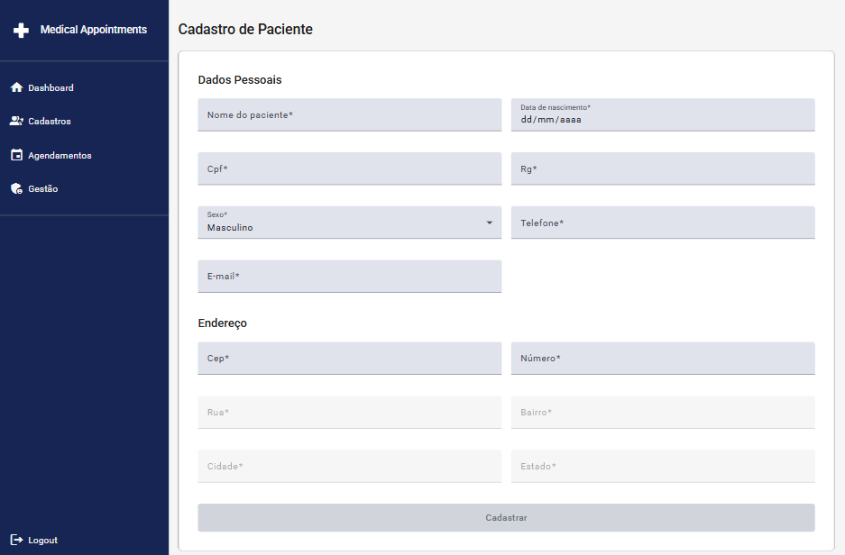
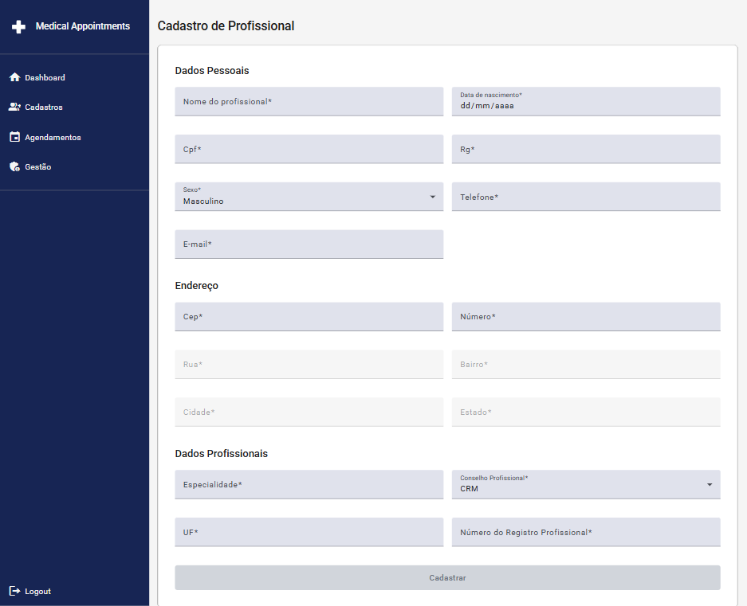
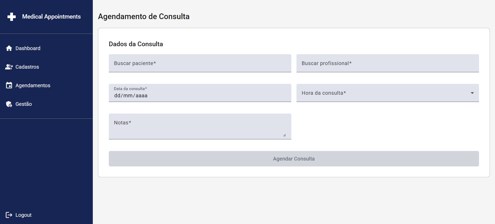
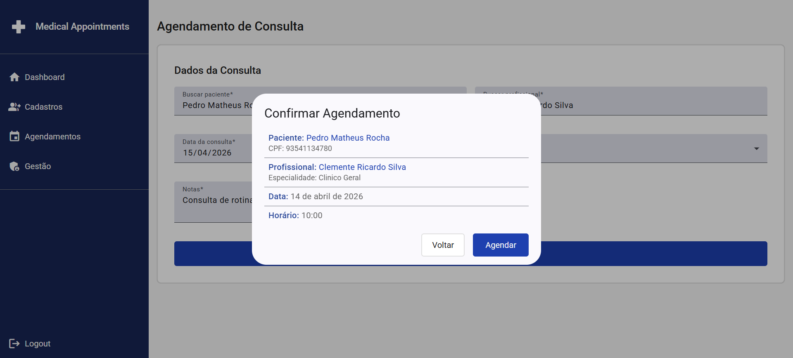

## 🏥 Medical Appointments System - Angular + Supabase + Firebase Authentication + Angular Material

Aplicação web para gerenciamento de pacientes, profissionais de saúde e agendamento de consultas médicas.  
O sistema digitaliza e otimiza o processo de agendamento, reduzindo erros operacionais e oferecendo uma experiência fluida para pacientes e profissionais.

### Principais características:
- **Autenticação** via Firebase Authentication
- **Persistência de dados** com Supabase (PostgreSQL + API)
- **Interface moderna e responsiva** com Angular Material
- **Formulários reativos** com validações customizadas (CPF, senha, etc.)
- **Busca automática de endereço** via API ViaCEP
- **Arquitetura escalável e modular (feature-based + core)**, seguindo princípios de *Separation of Concerns* e *Single Responsibility*
- **Uso de RxJS** para programação reativa e otimização de buscas
- **Testes unitários** com Jasmine e Karma

## 🧱 Arquitetura

- Arquitetura **feature-based** organizada por domínio (auth, patient, professional, appointment)
- Camada **core** para recursos reutilizáveis e desacoplados (validators, interfaces, services)
- Separação clara entre layout, páginas, serviços e guards
- Código orientado à **manutenibilidade** e **escalabilidade**

## 🛠️ Diferenciais Técnicos

- Uso de **Standalone Components** no Angular
- Aplicação de **programação reativa** com RxJS
- Arquitetura escalável e modular, seguindo princípios de **Separation of Concerns** e **Single Responsibility**
- Integração com múltiplos serviços (Firebase, Supabase, ViaCEP)

## 🚀 Tecnologias Utilizadas

- Angular v18
- Firebase Authentication
- Supabase (Database)
- Angular Material
- SCSS (Sass)
- Reactive Forms / FormBuilder
- TypeScript
- RxJS
- Jasmine / Karma

## ⚙️ Funcionalidades

- **Login e Registro de Usuários** com validação reativa
- **Cadastro de Pacientes** com dados pessoais e endereço
- **Cadastro de Profissionais** com dados pessoais, endereço e dados profissionais (CRM, COREN, CRP etc.)
- **Agendamento de Consultas** com busca dinâmica de pacientes e profissionais via autocomplete
- **Validação de CPF e Senha** com validators customizados
- **Feedback visual com Toasts** para sucesso e erro
- **Resumo da Consulta** exibido antes da confirmação
- **Horários dinâmicos** só aparecem após seleção de profissional e data, consultando disponibilidade no Supabase

## 🔐 Segurança e Controle de Acesso

- Autenticação via Firebase Authentication
- Proteção de rotas com **Guards**
- Separação entre rotas públicas e privadas
- Redirecionamento automático baseado no estado de autenticação

## 🧪 Testes

- Testes unitários para serviços, guards e componentes
- Uso de **Jasmine** e **Karma**
- Foco em confiabilidade, regressão e manutenibilidade

## 🧩 Estrutura do Projeto

```
 src/
 ├─ app/
 │  ├── core/
 │  │   ├── adapters/                   # Mapeamento e transformação de dados
 │  │   ├── constants/                  # Constantes globais da aplicação
 │  │   ├── interfaces/                 # Contratos e tipagens compartilhadas
 │  │   ├── layout/                     # Componentes estruturais globais
 │  │   ├── services/                   # Serviços globais
 │  │   ├── types/                      # Tipos auxiliares e utilitários
 │  │   └── validators/                 # Validações customizadas reutilizáveis
 │  │
 │  ├── features/
 │  │   ├── dashboard/
 │  │   │   ├── dtos/                   # Estruturas de dados
 │  │   │   ├── pages/                  # Componentes de página
 │  │   │   ├── services/               # Regras e consultas
 │  │   │   ├── types/                  
 │  │   │   └── dashboard.routes.ts     # Configuração de rotas
 │  │   │
 │  │   ├── patients/
 │  │   │   ...                  
 │  │   │
 │  │   ├── professional/
 │  │   │   ...  
 │  │   │
 │  │   ├── appointment/
 │  │   │   ...  
 │  │   │
 │  │   ├── auth/
 │  │   │   ├── dtos/                    
 │  │   │   ├── guards/                  # Proteção de rotas
 │  │   │   ├── layout/                  # Layout público (login/cadastro)
 │  │   │   ├── pages/                   # Telas de autenticação
 │  │   │   ├── services/                # Integração com autenticação
 │  │   │   └── auth.routes.ts           # Rotas públicas
 │  │
 │  └── app.component.ts
 │
 ├─ environments/
 │  └── environment.ts                  
 │  
 ├─ styles/
 │  ├── _material-theme.scss             # Estilização personalizada do Angular Material
 │  ├── _reset.scss                      # Reset de estilos
 │  └── _variables.scss                  # Variáveis globais de design
 │  
 └── styles.scss                         # Arquivo global de estilos da aplicação

 ```

## 🔧 Como Executar

### 1. Clonar o repositório

```bash
git clone https://github.com/pedrogles/medical-appointments.git
```


### 2. Instalar dependências

```bash
npm install
```


### 3. Configurar Firebase e Supabase

#### 3.1 Criar projeto no Firebase
- Acesse o Firebase Console (console.firebase.google.com in Bing)
- Crie um novo projeto.
- Vá em Authentication → habilite o método E-mail/Senha.
- Copie as credenciais do seu app (API Key, Auth Domain, etc).
- Adicione as credenciais em src/environments/environment.ts

#### 3.2 Criar projeto no Supabase
- Acesse o Supabase.
- Crie um novo projeto.
- Copie a URL e a anon key (chave pública).
- Adicione as credenciais em src/environments/environment.ts

```
export const environment = {
  firebase: {
    apiKey: 'SUA_API_KEY',
    authDomain: 'SEU_DOMINIO.firebaseapp.com',
    projectId: 'SEU_PROJECT_ID',
    storageBucket: 'SEU_BUCKET.appspot.com',
    messagingSenderId: 'SEU_ID',
    appId: 'SEU_APP_ID'
  },
  supabase: {
      url: "SEU_DOMINIO.supabase.co",
      anonKey: "SEU_ANONKEY"
  },
  viaCepUrl: "https://viacep.com.br/ws"
};
```

#### 4. Executar a aplicação

```bash
ng serve
```


Acesse: http://localhost:4200

## 🧠 Principais Recursos do Angular Utilizados

- **Reactive Forms com FormBuilder**  
  Utilizados para gerenciar formulários complexos de agendamento médico, garantindo validação reativa e feedback instantâneo ao usuário.

- **Angular Material para UI e UX**  
  Componentes modernos e responsivos aplicados em tabelas de pacientes, calendários de consultas e diálogos de confirmação, oferecendo uma experiência consistente e acessível.

- **SCSS modularizado**  
  Estilos organizados por módulos (core e features), permitindo fácil manutenção e personalização da interface sem comprometer a escalabilidade.

- **Arquitetura escalável (Core e Features)**  
  Separação clara entre funcionalidades centrais (autenticação, serviços de API) e módulos específicos (consultas, pacientes, médicos), facilitando a evolução do sistema e a integração com Firebase e Supabase.

## 📚 Documentação

- [Documentação do Projeto](https://docs.google.com/document/d/1gmItQsB81GD2Acw4Q5l927LNLs_6PFfGRxtAbhK-600/edit?usp=sharing)  
  Guia detalhado de requisitos, arquitetura e decisões técnicas do sistema.

- [Documentação do Angular](https://angular.io/docs)  
  Referência oficial para desenvolvimento com Angular, incluindo Reactive Forms e Angular Material.

- [Documentação do Firebase](https://firebase.google.com/docs)  
  Guia de autenticação, configuração de projetos e integração com aplicações web.

- [Documentação do Supabase](https://supabase.com/docs)  
  Referência para banco de dados, autenticação e APIs em Supabase.

## 🖼️ Screenshots

<div style="display: flex; flex-direction: column; gap: 1rem">
  
  
  
  
  
  
  
</div>